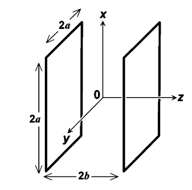

# Helmholtz calculations
**NOTE:** This README requires a [MathJax](https://chrome.google.com/webstore/detail/mathjax-plugin-for-github/ioemnmodlmafdkllaclgeombjnmnbima/related) browser plugin for the mathematics to be rendered.
## Theory
The purpose of this file is to describe how the current  required to generate a 2-gauss magnetic field  is obtained.

    

Important things to note:

- Coils must be square

- $\gamma$ is defined as 0.5445 (explained below)

- We are defining the strength of the magnetic field at the absolute centre

\
The field is defined as:

$$
B=\frac{2\mu_{0}NI}{\pi a}\frac{2}{(1+\gamma^2)\sqrt{2+\gamma^2}}
$$

Where... 

$B$ is the magnetic field (T)

$\mu_{0}$ is the permeability of a vacuum constant: 4 $\pi \times 10^{-7}$ (N/A $^{2}$)

$a$ is $\frac{1}{2}$ of the side length (m)

$\gamma$ is the ratio of the distance between the two coils (2b) and the length of the side of a coil (2a) 

$N$ is the number of loops of wire 

## Finding $N$

We can find $N$ in 2 steps

1. Define diameter of wire and width of U-Channel. 
2. Divide width by diameter, and round down to nearest whole number to find N.

We find the maximum ammount of turns to minimize current required (as shown in the field equation).

## Finding $I$

We can rearrange the equation to look like this

$$
I=\frac{\pi a (1+\gamma^2)(\sqrt{2+\gamma^2})B}{4\mu_0 N}
$$

Recall: Our goal is to achieve 2 gauss  $∴$ $B$ = 2 Gauss= 0.0002 Tesla

Plugging in our values for $a$, $N$, $\gamma$, $\mu_0$ and $B$
we can isolate for current.

## Putting it All Together

Here's an Example: 

-24 AWG wire diameter = 0.51054mm

-1.5 inch u-channel width = 38.1mm

$N$ = 74

$a$= 2.4/2 = 1.2 (assuming side length is 2.4m approx)

$\gamma$ = 0.5445

$B$ = 0.0002 

$\mu_0 = 4\pi \times 10^{-7}$

$∴ I = 3.9825$ Amps

# Side length Deduction

Purpose of this section is to deduce the side length required

Note:
- 40 Cm total length (38.5cm in reality), therefore 20cm off origin (assuming centre of field is centre of FINCH).
- Less than 5% variation required towards the end of the uniform space.

This is the equation that defines the variation along the $x$ distance traveled away from the centre of the $z$ field. 

$$\frac{B_z(x,0,0)}{B_z(0,0,0)}=1 - 0.40017(\frac{x}{a})^4$$

$x$ is defined to be the largest variation from the center. Therefore 

$$0.95=1-0.40017(\frac{0.2}{a})^4$$

Therefore 

$$a= 33.6cm $$
Therefore
sidelength = 2a = 67.27885 cm

## Reference 

The calculation is following [this document](https://ieeexplore.ieee.org/document/4278170) 
